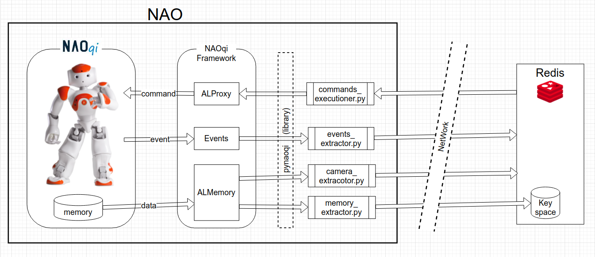

# NAO Interface

This module constitutes the interface between NAOqi and Redis.

## Requirements
The following software has to be installed on NAO:
* Python 2.7
    * [multiprocessing](https://docs.python.org/2/library/multiprocessing.html) : python library to execute all processes as concurrent subprocesses
    * [redis](https://pypi.org/project/redis/): python library that provides a Redis Client to manage a connection to a  remote Redis Server
* PyNAOqi - the python library for NAO interaction.
You can download it [here](https://developer.softbankrobotics.com/)

## Quick start
* copy this directory into the NAO OS
* change `configuration.py` to configure IP and Port of NAOqi and Redis
    * you may want to leave NAO to the default values
* edit `commands.txt`, `events.txt` and `memory.txt` to define
which commands, events and memory value are to be exported 
* execute the software with the command `python main.py`

## Scope / Goal
To increase the modularity of the Robot,
as well as provide a unified interface for all programs,
we developed this interface that extracts NAO memory and sensors
on Redis database keys and channels respectively,
and executes any command given on a separated Redis channel.

## Description

The robot NAO is entirely controlled by NAOqi OS.
The control of the Robot is made available through numerous Proxies,
which provide an interface for all the internal states of the robot (from memory saved data, to raised events). 

This module make use of the PyNAQqi library to interface with NAOqi Memory and Proxies.

Following a description of the 4 main processes that together form the whole Interface:
* Events Extractor
* Memory Extractor
* Camera Extractor
* Commands Executioner

### Events Extractor
This process subscribes to all events listed in `events.txt`
and publish the received data of every raised event, to a Redis channel called `events`.

The format of a message is
`[name];[value];[id]`
where:
* `name` is the name of the event generated
* `value` is the eventual value that comes with the event
* `id` is a unique id among all events 

To perform said actions the module makes use of code introspection
to define the variable, as well as subscribe to all events and
automatically generate a class and a handle for each of them.

### Memory Extractor
This process subscribes to all memory modules listed in `memory.txt`
and sets the read data of every memory area, as a Redis key
named exactly as the memory module.
The values are updated 10 times per second.

To perform said actions the module makes use of code introspection
to define the variables, as well as set all the Redis keys.

### Camera Extractor
This process can be seen as an extension of the previous two.
It extracts both the camera images from the proper proxy,
and publishes them:
- on Redis channels called `camra0` and `camra1` respectively
- setting the Redis keys `camra0` and `camra1` respectively.

To extract the data received and make it meaningful,
it as advised to use the following code  
`naoImage = eval(redis_received_data)`  
`img = PIL.Image.frombytes("RGB", (naoImage[0], naoImage[1]), naoImage[6])`  

### Commands Executioner
This process can execute given commands on the proxies previously defined in `commands.txt`.
It reads all the messages published on a Redis channel called `commands` and
and, after the execution of the command is completed, it returns the eventual
response on a separated channel called `response`.

A command is to be a string of the following format:
`proxy;command;parameters`
where:
* `proxy` is the name of the proxy on which the commands must be executed
* `command` is the name of the command to be executed
* `parameters` is an array of values to be passed as arguments for said command.
If the command doesn't require any parameter, an empty array must be defined. 

A response is a string of the following format:
`command;return`
where:
* `command` is the command executed
* `return` is the returned value. If no value is returned, than None is given.

To perform said actions the module makes use of code introspection
to define the variable, as well as subscribe to all needed proxies and
execute the code on each of them.

## Examples
We provided `listener.py` as an example code that shows how to
interact with the interface via Redis.
This code can be executed on a different computer outside NAO,
as long as it can reach and communicate with the Redis Server.
