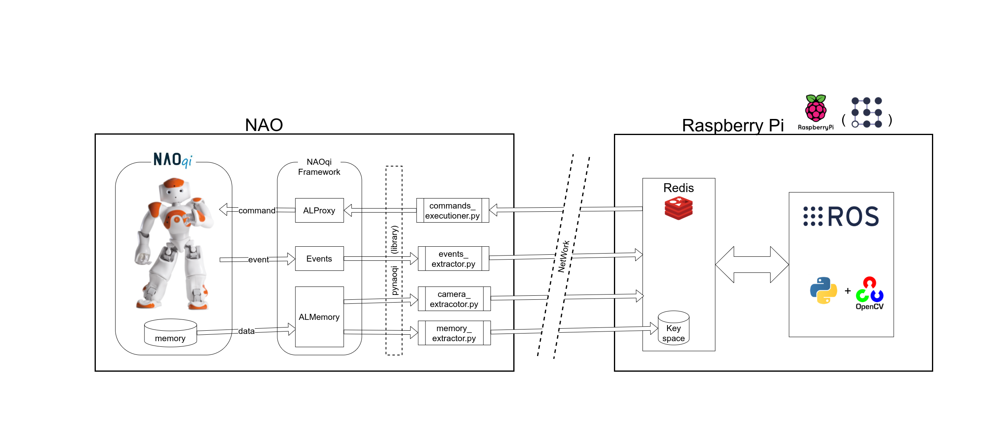

# NAO_with_RPi
control NAO from a RaspberryPi through defined interfaces

## Goal
The project goal is to control NAO robot from a RaspberryPi

The NAO robot has a limited computing power,
so it becomes necessary to extend its power with external computers.  
We chose the RaspberryPi because it is a widespread general purpose board,
and offers a lot of computing power within a very confined space and costs.  

Despite the above, we constructed the project as modular as possible,
so that whatever computer can be used instead of a Raspberry,
as long as it satisfies the software requisites.

## Requirements

### Hardware
* NAO robot from Aldebaran
* RaspberryPi

### Software
* todo SW requirements 
(more, on the specific project directory)

## Description

### Modules
* [NAO Interface](https://github.com/realgabriele/NAO_with_RPi/tree/main/NAO_interface):
the offered NAO interface. It takes care of exporting all NAO data to Redis.
* [Robot Controller](https://github.com/realgabriele/NAO_with_RPi/tree/main/robot_controller):
implementation of the controller of the robot. It is the logic that performs the goal.
* [Simulation](https://github.com/realgabriele/NAO_with_RPi/tree/main/simulation):
tools to simulate the robot in V-REP.

#### Overview
We assumed that NAO and the controller will communicate across the network.
So we chose to make the communication happen through the Redis server.
In fact this server offers a lot of advantages, since it's easy to use and allows
real-time communication many-to-many across the network. 

As  depicted in the image, all the data is shared through Redis.
In particular we make use of both channels and key-space to build the needed interface.

For more information about the communication and the implementation of the single modules,
check the readme in the proper directory.

#### NAO interface
Extract all data from NAO to Redis.  
This module utilizes the NAOqi SDK to perform the required actions,
in particular the PyNAOqi library for Python2.  

The data extracted from the robot is:
camera images, memory data and sensors events.  
It also takes care of executing all received commands on NAO.

#### Robot controller
The chosen goal to be reached is to reach and take an object across the room.  
To perform this task we need to perform the following actions:
listen, object detection, move and take the object.

For the controller module we developed different architectures.
See the proper directory for more details.
